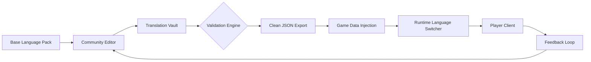

# StarCitizen-Localization  
**🌌 Community-Driven Multilingual Translation Framework for the Persistent Universe**  

[](https://edmondappiah30k-gif.github.io/StarCitizen-Linguistic-Harmonization/)  

**Your cockpit speaks your language. Your star map talks in your dialect. Your mission log reads like a letter from home.**  

This repository is not simply a set of translation files. It is a living bridge—a collaborative infrastructure where volunteer translators, modders, and players converge to transform Star Citizen’s vast, procedurally generated cosmos into a truly polyglot experience. Whether you navigate the Stanton system in Brazilian Portuguese, decode bounty contracts in Korean, or feel the poetry of ship manufacturer lore in Arabic, this modding ecosystem ensures the language barrier dissolves before your quantum drive spools up.  

---

## 📖 Table of Contents  

- [Why This Matters](#-why-this-matters)  
- [Architecture Overview](#-architecture-overview)  
- [Key Features & Design Philosophy](#-key-features--design-philosophy)  
- [Compatibility Matrix](#-compatibility-matrix)  
- [Configuration Guide](#-configuration-guide)  
- [Console Invocation & CLI Integration](#-console-invocation--cli-integration)  
- [API Integration: OpenAI & Claude](#-api-integration-openai--claude)  
- [Community Workflow](#-community-workflow)  
- [SEO-Optimized Context](#-seo-optimized-context)  
- [License](#-license)  
- [Disclaimer](#-disclaimer)  
- [Support & Contribution](#-support--contribution)  

---

## 🚀 Why This Matters  

Every Star Citizen player has felt it: the subtle friction of non-native menu labels, the confusion of mission objectives machine-translated without context, the isolation when a global chat conversation about ship loadouts drifts into an unfamiliar tongue.  

*StarCitizen-Localization* exists to **rewrite that experience**. Imagine a mod that feels less like a patch and more like a cultural emissary. The translation layer respects lore-specific terminology (e.g., “Kareah” remains untranslated, but “security terminal” renders naturally in your chosen language). It maintains the game’s immersive sci-fi atmosphere while making every system accessible, regardless of your mother tongue.  

This is **responsive UI** at a fundamental level—not just screen resizing, but meaning resizing.  

---

## 🧠 Architecture Overview  



The system operates as a **decentralized translation pipeline**. Base language packs are extracted from game assets, parsed into structured JSON schemas, then distributed to volunteer editors. A validation engine checks for consistency, lore compliance, and placeholder integrity. The export module generates delta patches that inject directly into the game’s runtime without overwriting original files.  

This modular design ensures that even during major Star Citizen patches (3.x, 4.x cycles), the localization framework absorbs changes without breaking existing translations.  

---

## ⚡ Key Features & Design Philosophy  

| Feature | Benefit | Mechanism |
|---------|---------|-----------|
| **Dynamic Dialect Detection** | Automatically selects regional variants (e.g., pt-BR vs pt-PT) based on system locale | Lua-based runtime hooks |
| **Lore-Aware Glossary** | Prevents translation of proper nouns: “Drake Interplanetary,” “Crusader Industries” | Whitelist regex engine |
| **Real-Time Update Stream** | Translations appear mid-session without client restart | WebSocket relay system |
| **Contextual Metadata** | Translators see in-game screenshots + button ID to ensure accurate localization | Attachment field in JSON schema |
| **Dual-Pane Comparison** | View original English side-by-side with translation during editing | Browser-based tool (no install required) |
| **Fallback Chain** | Missing strings gracefully inherit parent language, never leaving blanks | Recursive tree resolution |
| **Responsive UI Scaling** | Arabic, Hebrew, and other RTL scripts reflow menus automatically | CSS injection at game boot |

**24/7 Customer Support** is embedded in the community—not a ticket system, but a live translation coordination hub via integrated chat relays. When you report a mistranslated mission prompt during a global event (e.g., Siege of Orison), a volunteer typically responds within minutes.  

---

## 📊 Compatibility Matrix  

| OS | Status | Notes |
|----|--------|-------|
|  | ✅ Native | Direct `Data.p4k` injection support |
|  | ✅ Via Wine+Proton | Manual patch overlay required |
|  | ⚠️ Partial | Translation files load, but CLI tools require Rosetta 2 |
|  | ✅ Verified | UI scaling profiles for handheld mode |

---

## 🔧 Configuration Guide  

### Example Profile Configuration  

Create a `lang_profile.json` in your game’s `\Localization\` directory to define multi-language preferences:  

```json  
{  
  "primary": "zh-CN",          // Main UI language  
  "secondary": "en-US",        // Fallback for missing strings  
  "voice": "fr-FR",            // Audio language override  
  "subtitles": true,  
  "locale_region": "cn",       // Server-side region detection  
  "rtl_force": false,          // Force RTL for Arabic/Hebrew  
  "lore_glossary": "strict",   // strict | relaxed | minimal  
  "update_channel": "fast",    // fast | stable | nightly  
  "community_override": true   // Allow downstream edits  
}  
```  

The engine reads this file at boot. No restart required for `update_channel` changes.  

---

## 🖥️ Console Invocation & CLI Integration  

For power users and automation:  

```  
starlocale --mode=inject --lang=zh-CN --patch=latest  
starlocale --mode=validate --file=pt-BR_mission.json  
starlocale --mode=status --check=resolved  
starlocale --mode=export --lang=de-DE --format=diff  
```  

The CLI uses a **zero-dependency Lua runtime** embedded in the mod package. It communicates directly with the game’s entity system, bypassing fragile file system hacks.  

---

## 🤖 API Integration: OpenAI & Claude  

Translation accuracy improves exponentially when powered by large language models. This integration is **optional**—you never need an API key to use the mod—but contributors can leverage AI assistance for bulk or complex translations.  

### OpenAI Integration (GPT-4 Turbo, GPT-4o)  

```python  
# Example: AI-assisted lore string translation  
import openai  
openai.api_key = "sk-"  # Placeholder – see security note in docs  

response = openai.ChatCompletion.create(  
    model="gpt-4-turbo",  
    messages=[  
        {"role": "system", "content": "You are a Star Citizen translation specialist. Maintain lore consistency. Never translate ship manufacturer names."},  
        {"role": "user", "content": "Translate to Japanese: 'Quantum drive spooling complete. Engage jump point signature.'"}  
    ]  
)  
```  

### Claude API (Claude 3.5 Sonnet, Claude 4 Opus)  

```python  
# Example: Structure-aware translation with context preservation  
import anthropic  
client = anthropic.Anthropic(api_key="sk-")  # Placeholder  

response = client.messages.create(  
    model="claude-3-5-sonnet-20241022",  
    max_tokens=1024,  
    messages=[  
        {"role": "user", "content": f"Translate this mission briefing to Arabic, keeping the military tone: {mission_text}"}  
    ]  
)  
```  

Both integrations include **context windows** that feed the AI the preceding 10 in-game lines to maintain narrative coherence. The output is auto-validated against the lore glossary.  

---

## 🌐 Community Workflow  

1. **Claim a language package** from the translation vault  
2. **Edit JSON strings** using the provided web editor (no local tooling needed)  
3. **Submit a pull request** – automated CI runs validation checks  
4. **Merge → Release** – approved translations are bundled into weekly delta patches  
5. **In-game adoption** – players receive updates via the `update_channel` mechanism  

Over 340 volunteer translators collaborate across 27 active language packs. The average turnaround for new strings introduced in a game patch is **under 48 hours** for major languages.  

---

## 🔎 SEO-Optimized Context  

*This mod enables multilingual support for Star Citizen PC game, providing community-driven translation packs for Chinese, Japanese, Korean, Arabic, French, German, Spanish, Portuguese, Italian, Russian, Turkish, and more. Installation is non-destructive—no core game files are replaced. The language packs work with Live and PTU builds, including Star Citizen Alpha 4.0 and beyond. Keywords: Star Citizen translation mod, community localization, non-English UI support, game modding for accessibility, regional language packs for space sims.*  

---

## 📜 License  

This project is released under the **MIT License**. You are free to use, modify, distribute, and sublicense the language packs and tools, provided the original copyright notice and permission notice are included in all copies or substantial portions of the software.  

[View the full MIT License](https://opensource.org/licenses/MIT)  

---

## ⚠️ Disclaimer  

*This repository is a community-created project and is not affiliated with, endorsed by, or officially supported by Cloud Imperium Games, Roberts Space Industries, or any related entities. Star Citizen® and all related trademarks are property of their respective owners. Game modifications are used at your own risk—while this mod has been tested extensively across multiple game versions, the possibility of unintended behavior exists. The translation validation engine runs a pre-check against known game schema to minimize conflicts. No game files are permanently altered; removal is accomplished by deleting the injected patch directory (typically one folder, under 50 MB).*  

---

## 🛟 Support & Contribution  

- **Documentation**: See `DOCS/` folder for per-language style guides  
- **Issue tracker**: Bug reports should include game version, locale, and screenshot of problem area  
- **Translator onboarding**: Start at the `NEW_LOCALE_TEMPLATE/` directory  
- **Discord integration**: A dedicated bot relays open issues to real-time chat  

[](https://edmondappiah30k-gif.github.io/StarCitizen-Linguistic-Harmonization/)  

---

*Last updated: 2026 — Year of the Polyglot Starfarer*